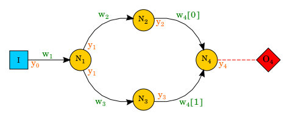
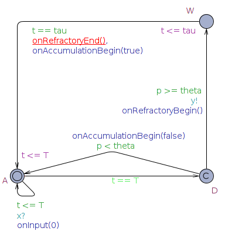
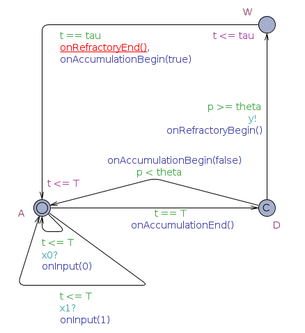
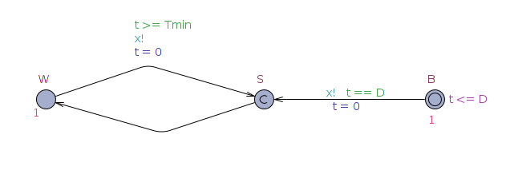
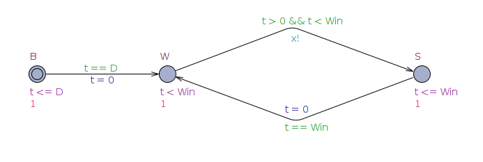
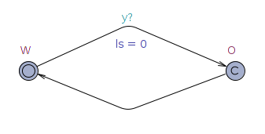

Spiking Neural Networks as Timed Automata
=========================================
##### Giovanni CIATTO, Elisabetta DE MARIA, Cinzia DI GIUSTO

Example and generation tool
---------------------------

### Prerequisites
* The `Uppaal` simulator, version `>= 4.1`, is necessary to show, simulate and verify the provided examples. It can be downloaded here: <http://www.it.uu.se/research/group/darts/uppaal/download.shtml>.
* The `Eclipse` IDE with the `Xtext` plugin, may be useful to manipulate the *Network Generator* code. It can be downloaded here: <http://www.eclipse.org/Xtext/download.html>.
* The `Java 8` virtual machine is needed to execute the pre-compiled *Network Generator*. The `JRE` can be download here: <http://www.oracle.com/technetwork/java/javase/downloads/jre8-downloads-2133155.html>.

### Outline
* Directory `examples` contains some examples of `Uppaal` systems implementing Spiking Neural Networks as Timed automata, according to our model. Descriptions will follow.
* Directory `network_description_language` contains several `Xtext` projects implementing the *Network Generator* and the respective `Eclipse` plugin. We kindly suggest to manipulate such code by means of the `Eclipse` IDE.
* File `ndl2uppaal.jar` is a Java console application implementing the *Network Generator*. The only requirimenet is `Java 8`.

### Diamond example
The `examples/diamond.xml` file is an `Uppaal` system representing a Spiking Neural Network. The network topology is the diamond shown in the following figure:



where:
* `I` is an *Input Generator*;
* `O` is an *Output Consumer*;
* `N_i` is the `i`-th neuron;
* `y_i` is the *broadcast channel* carrying the output of the `i`-th neuron,
    * `y_0` carryies the output of the input generator;
* `w_i[j]` is the *weight* of the `j`-th input synapse of the `i`-th neuron,
    * if the neuron only has 1 input synapse, the `[j]` index is omitted.

The file contains a *Declarations* section (contining global definitions), a number of *templates* (each defining one *Timed Automaton* structure and behavior) and a *System declarations* section (where template template are instantiated and interconnected).


#### Global Declarations
Shared symbols and types are defined in this section of the `examples/diamond.xml` file.

```c
// Fraction type definition
// as a <num, den> pair
typedef struct {
    int num;
    int den;
} ratio_t;

// Discretization Granularity constant definition
// The [0, 1] real interval is divided into R parts:
// this is how real number are represented
const int R = 100;

// Synaptic weight type definition
// as an integer in the -R ... R interval
typedef int[-R, R] weight_t;

// Synaptic weights definitions
weight_t w1[1] = { R }; // w_1 = 1
weight_t w2[1] = { R / 2 }; // w_2 = 0.5
weight_t w3[1] = { R / 2 }; // w_3 = 0.5
weight_t w4[2] = { R / 4, R / 3}; // w_4[0] = 0.25 and w_4[1] = 0.33

// Output channels definitions
broadcast chan y0;
broadcast chan y1;
broadcast chan y2;
broadcast chan y3;
broadcast chan y4;
```

#### The `Neuron<N>` templates
This is the template of a neuron having `N` input sources `x0`, `x1`, ..., `x(N-1)`.
The template has the following arguments list:

```c
broadcast chan & x0, // The reference to the first input channel
broadcast chan & x1, // The reference to the second input channel
...,
weight_t & w[N], // The reference to the array containing N synaptic weights
broadcast chan & y // The reference to the output channel
```

The following images show the structure of these templates in the cases `N = 1` and `N = 2`, respectively:




The behavior of the automaton is described by the following `Uppaal` code:

```c
clock t; // Only one clock per neuron is needed
const int T = <accumulation period duration>;
const int tau = <refractory period duration>;
const int theta = <threshold value>;
ratio_t lambda = { <leak factor numerator>, <leak factor denominator> };

// Stores the sum of weighted inputs for each accumulation period
int a = 0;
// Stores the neuron potential
int p = 0;

// Updates the potential at the end of each accumulation period
void updatePotential() {
    p = (a * lambda.den + p * lambda.num) / lambda.den;
}

// Accumulates an input spike carryed by the i-th input synapse
void onInput(int i) {
    a += w[i];
}

// Invoked at the end of each accumulation period
void onAccumulationEnd() {
    updatePotential();
}

// Invoked at the beginning of each accumulation period
// @param hasEmitted is true if the neuron emitted a spike at the end of the
//     previous accumulation period
void onAccumulationBegin(bool hasEmitted) {
    t = 0;
    a = 0;
}

// Invoked at the end of each refractory period
void onRefractoryEnd() {

}

// Invoked at the beginning of each refractory period
void onRefractoryBegin() {
    p = 0;
    t = 0;
}
```


#### The `NonDeterministicInput` template
This is the template of an *Input Generator* producing a random spike sequence, after a given initial delay `D`, where the time distance between two consecutive spikes is always equal to or greather than `Tmin`.
The template has the following arguments list:

```c
// The reference to the channel carrying the produced sequence
broadcast chan & x
```

The following image shows the structure of this template:



The `Uppaal` code of such a template is simply:

```c
clock t; // Only one clock per Non-Deterministic Input Generator is needed
const int D = <duration of the initial delay>;
const int Tmin = <minimum inter-spike period duration>;
```


#### The `FixedRateInput` template
This is the template of an *Input Generator* producing exactly one spike for each time window `Win`, after a given initial delay `D`.
The template has the following arguments list:

```c
// The reference to the channel carrying the produced sequence
broadcast chan & x
```

The following image shows the structure of this template:



The `Uppaal` code of such a template is simply:

```c
clock t; // Only one clock per Fixed-Rate Input Generator is needed
const int D = <duration of the initial delay>;
const int Win = <duration of the time window>;
```

#### The `Output` template
This is the template of an *Output Consumer* allowing to inspect the outcome of some output neuron.
The template has the following arguments list:

```c
// The reference to the channel carrying the sequence to be consumed
broadcast chan & y
```

The following image shows the structure of this template:



The `Uppaal` code of such a template is simply:

```c
// An ls (Last Spike) clock is needed for each Output Consumer, allowing it to
// measure the elapsed time since the last received spike
clock ls;
```

#### The System Declarations
This section of the `examples/diamond.xml` file is where templates are instantiated and channels are shared in order to specity the to-be-inspected Neural Network.

```c
// Input producers

I = FixedRateInput(y0); // `I` will send spikes over the y0 channel
// I = NonDeterministicInput(y0);


// Neurons

N1 = Neuron1(y0, w1, y1); // `N1` will consume spikes from the y0 channel, with weight w1[0], and send them on the y1 channel
N2 = Neuron1(y1, w2, y2); // `N2` will consume spikes from the y1 channel, with weight w2[0], and send them on the y2 channel
N3 = Neuron1(y1, w3, y3); // `N3` will consume spikes from the y1 channel, with weight w3[0], and send them on the y3 channel

N4 = Neuron2(y2, y3, w4, y4); // `N4` will consume spikes from the y1 channel, with weight w4[0], and the y3 channel, with weight w4[1], and send them on the y4 channel


// Output consumers

O4 = Output(y4); // `O4` will receive the outcome of `N4` over the y4 channel

// The automata composing the system (i.e. to be executed) are the following
system I, N1, N2, N3, N4, O4;
```
